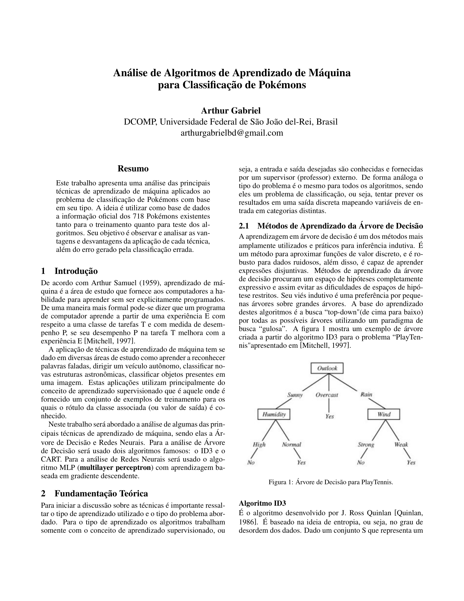
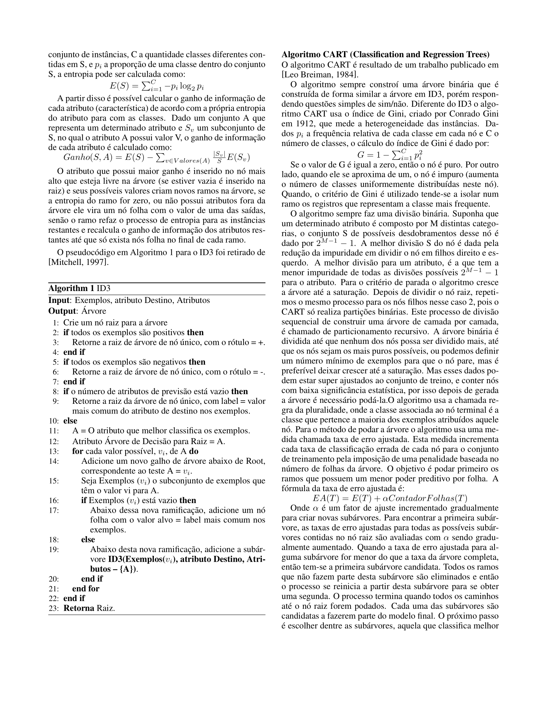
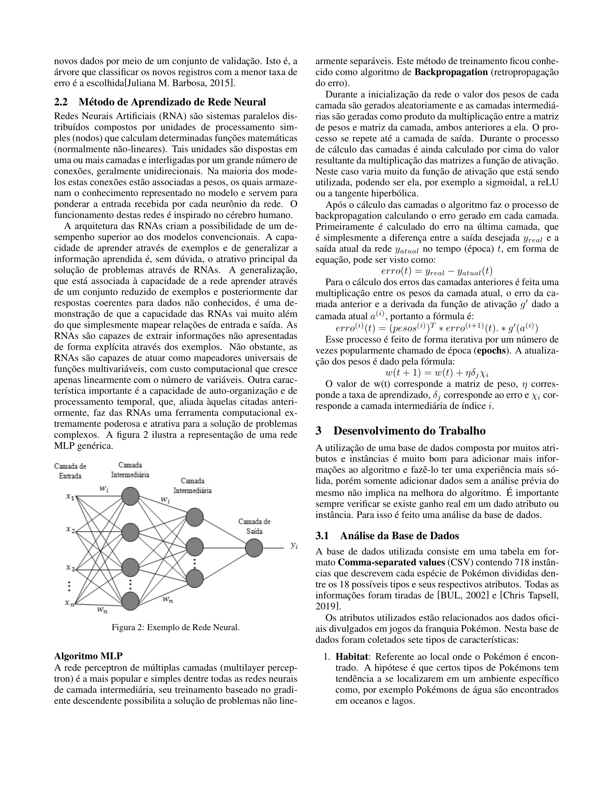
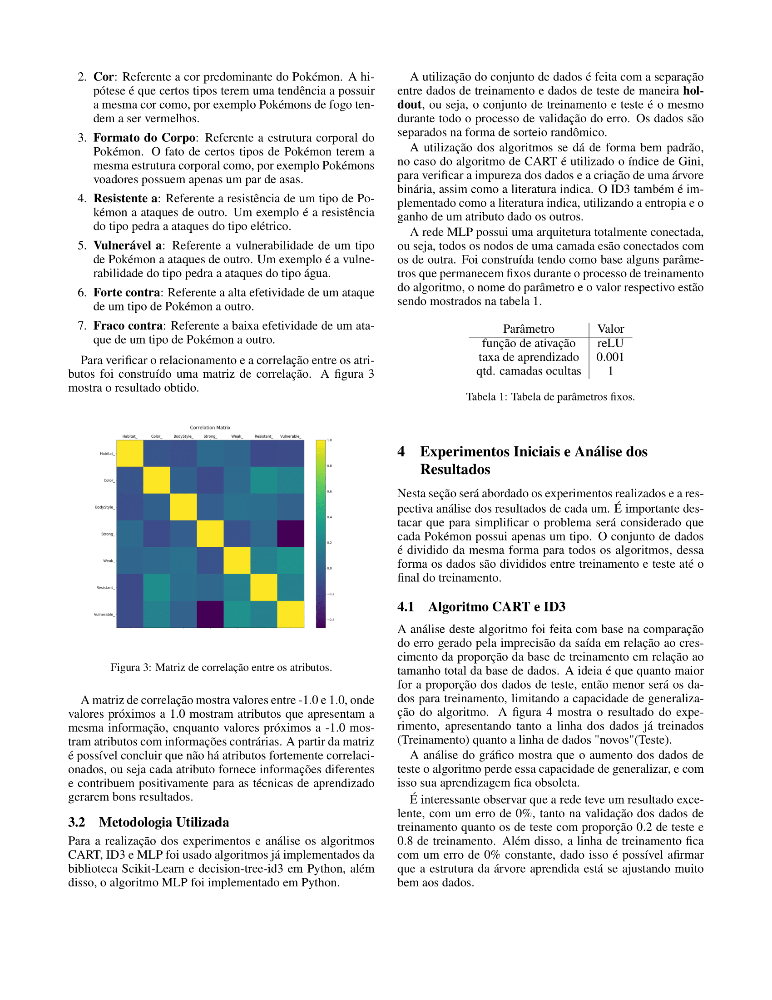
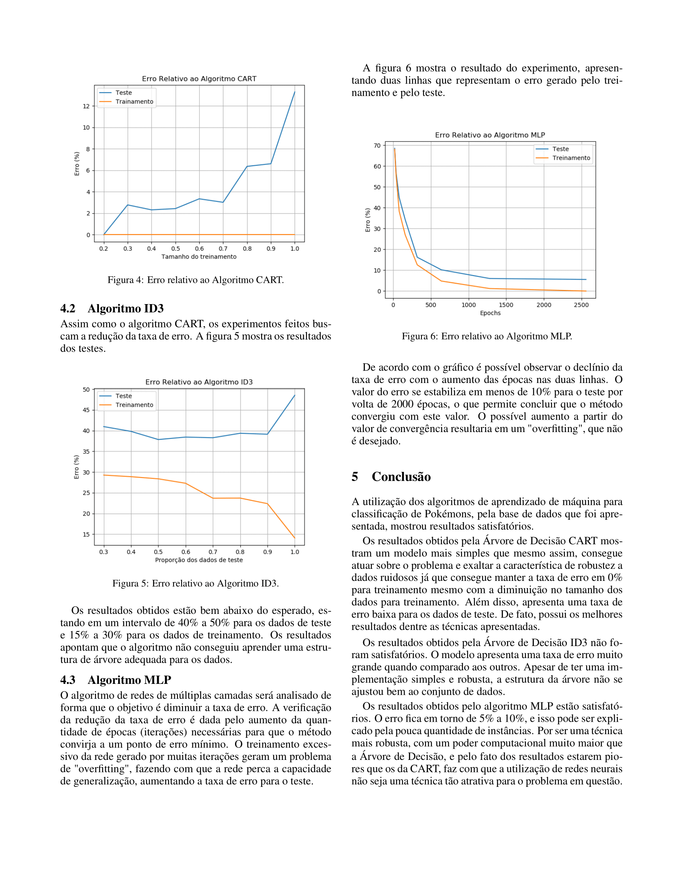

# Arthur Gabriel, 2019
# DCOMP, Universidade de São João del-Rei

Bibliotecas necessarias para executar tp1.py:

	-> Scikit-learn
	-> Pandas
	-> decision-tree-id3
	-> numpy
	-> matplotlib
	-> graphviz

Arquivos necessários para executar tp1.py: 
	
	OBS: O arquivo precisa apenas existir 
	dentro do diretório do arquivo tp1.py
	
	-> Pokemon.csv

Para executar o arquivo tp1.py é necessário possuir
a versão mais atual do python3, e executar o comando:

python3 tp1.py

